# 

#  本地环境

```shell
 1. redis ，192.168.110.100
 2.kafka localhost:9092
 3.
```


# 测试环境

## :one:  pc端

```shell
     http://iot.textile-saas.huansi.net/ 
     测试环境系统管理员账号更新为 iot.system@huansi.net  /   sysadmin   
     
     
     #kafka：
     http://121.199.175.235:31092/
     
     ##日志: 同步的日志
     http://k8s-log.textile-saas.huansi.net/pod_log/hsyl-iot.hs-data-sync
     长胜生产：http://121.4.80.151:32181/pod_log/hsyl-iot.tb-node?tail_lines=500
    长胜测试：http://k8s-log.textile-saas.huansi.net/pod_log/hsyl-iot.tb-node?tail_lines=500
```

### :b: 边端

```shell
http://10.10.11.56:88/login
1504646592@qq.com  123456


###测试边端数据库:
10.10.11.56 5432  postgres postgres
```


## :two: 看板

```shell
http://47.96.138.212:8370/factory?city=%E8%A5%BF%E6%B8%B8%E8%AE%B0&factoryId=7a0c79a0-f148-11ec-846b-e5d6d79ce73e
```


# 生产环境

```shell
1. 生产访问页面：
http://iiot.newtech-textile.com/
2.数据库
SPRING_DATASOURCE_URL:jdbc:postgresql://111.229.157.131:30682/hsiotdb
postgres/postgres
```

### 新乡工厂 

> 新乡向日葵地址：
> 946 157 768 
> 7641ms

 


# 看板

## 对外提供接口

####  1 设备详细接口

##### 1-1 具体接口地址

```shell
/api/three/kanban/integratedDeviceInterface?deviceId=ac0b7150-5656-11ec-a240-955d7c1497e4
```

#####  1-2 出参说明

https://docs.apipost.cn/preview/25ae03d09f7ee346/e7c75da0da2610e2?target_id=7c05caf1-9b6d-49a2-b8aa-fa37c69f7846


## 车间看板接口

### 产量趋势图的接口

#####  需求的截图

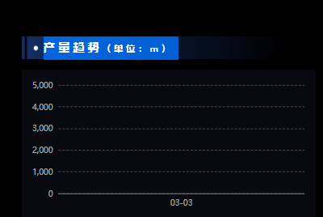

##### sql：

```sql
--  1 先由入参的车间id 查询设备id
select id  from  device  where id =?

-- 2. 查询这边的 表： hs_mes_device_relation
select *  from hs_mes_device_relation  where  device_id in ();

-- 3.查询sqlServr  设备id 查询车间id
SELECT B.uGUID,车间=B.sWorkCentreName FROM dbo.emEquipment A(NOLOCK) JOIN dbo.pbWorkCentre B(NOLOCK) ON B.uGUID = A.upbWorkCentreGUID WHERE A.uGUID= ?


--  4.查询sqlServer
SELECT 日期=A.sDate,产量=SUM(A.nTrackQty) FROM ( SELECT sDate=CONVERT(NVARCHAR(10),A1.tTrackTime,120),A1.nTrackQty FROM dbo.ppTrackOutput A1(NOLOCK) JOIN dbo.emEquipment B1(NOLOCK) ON B1.uGUID=A1.uemEquipmentGUID AND B1.upbWorkCentreGUID= ? WHERE A1.tTrackTime>=DATEADD(DAY,-7,CONVERT(NVARCHAR(10),GETDATE(),120)) ) A GROUP BY A.sDate


```


##### 接口地址：

```shell
/api/mes/board/capacity/trend?workshopId=f8b48230-589a-11ec-afcd-2bd77acada1c
```


###   产量top接口 :ok_hand: :bookmark:

####          需求截图

####          接口地址

 <p style="font-family: Arial;
    font-size: 18px;
    line-height: 30px;
    font-weight: bold;
    color: white;
    padding: 40px;
    box-shadow:
          inset #009688 0 0 0 5px,
      inset #059c8e 0 0 0 1px,
      inset #0cab9c 0 0 0 10px,
      inset #1fbdae 0 0 0 11px,
      inset #8ce9ff 0 0 0 16px,
      inset #48e4d6 0 0 0 17px,
      inset #e5f9f7 0 0 0 21px,
      inset #bfecf7 0 0 0 22px"> 接口内部调用 工厂看板的--能耗信息--top5接口</p>

> 该接口是前端提的;
>
> 接口的返回出参格式： /api/workshop/queryCapacitiesTop5
>
> 设备名称：deviceName；产量：output
>
> type: 'WATER' | 'ELECTRIC' | 'VAPOR'


#### sql 验证

```sql
with  table01  as (
SELECT
	d1.ID AS entity_id,
	MAX ( d1."rename" ) AS deviceName,
	SUM ( to_number( tb.water_added_value, '99999999999999999999999999.9999' ) ) AS water_added_value,
	SUM ( to_number( tb.electric_added_value, '99999999999999999999999999.9999' ) ) AS electric_added_value,
	SUM ( to_number( tb.gas_added_value, '99999999999999999999999999.9999' ) ) AS gas_added_value,
	SUM ( to_number( tb.capacity_added_value, '99999999999999999999999999.9999' ) ) AS capacity_added_value,
	MAX ( tb.ts ) AS ts 
FROM
	device d1
	LEFT JOIN hs_statistical_data tb ON d1.ID = tb.entity_id 
	AND tb.ts >='1677686400473' 
	AND tb.ts <'1677747122473' 
WHERE
	1 = 1 
	AND d1.workshop_id = 'ca654660-589c-11ec-afcd-2bd77acada1c' 
GROUP BY
	d1.ID
	)
	select * from  table01 where capacity_added_value is not null  ORDER BY capacity_added_value DESC
	LIMIT 5
	
```


### 生产进度跟踪接口 （mess提供sql）

#### 需求截图

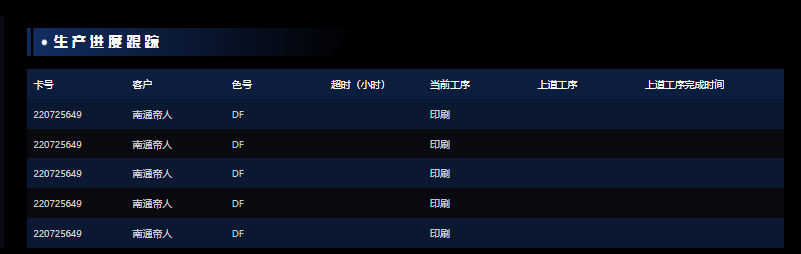

#### sql提供:(修改了)

```sql
SELECT
        TOP 10 
        max(A.tPlanEndTime),
        卡号 =   A.sCardNo,
        客户 = max(D.sCustomerName),
        色号 = max(E.sColorNo),
        [超时(小时)] = CASE
                WHEN max(F.uGUID) IS NULL THEN NULL
                WHEN max(F.tPlanEndTime)>GETDATE() THEN 0
                ELSE DATEDIFF(HOUR, max(F.tPlanEndTime), GETDATE())
        END,
        当前工序 = max(G.sWorkingProcedureName),
        上到工序 = max(I.sWorkingProcedureName),
        上工序完成时间 = max(H.tFactEndTime)
FROM
        dbo.psWorkFlowCard A(NOLOCK)
JOIN dbo.ppTrackJob B(NOLOCK) ON
        B.upsWorkFlowCardGUID = A.uGUID
        AND B.bIsCurrent = 1
JOIN dbo.sdOrderHdr C(NOLOCK) ON
        C.sOrderNo = A.sOrderNo
JOIN dbo.pbCustomer D(NOLOCK) ON
        D.uGUID = C.upbCustomerGUID
JOIN dbo.tmColor E(NOLOCK) ON
        E.uGUID = A.utmColorGUID
JOIN dbo.pbWorkingProcedure G(NOLOCK) ON
        G.uGUID = B.upbWorkingProcedureGUID
JOIN dbo.emEquipmentWorkingProcedure J(NOLOCK) ON
        J.upbWorkingProcedureGUID = G.uGUID
JOIN dbo.emEquipment K(NOLOCK) ON
        K.uGUID = J.uemEquipmentGUID
JOIN dbo.pbWorkCentre L(NOLOCK) ON
        L.uGUID = K.upbWorkCentreGUID
         -- AND L.uGUID = ?
LEFT JOIN dbo.psWPP F(NOLOCK) ON
        F.upsWorkFlowCardGUID = A.uGUID
LEFT JOIN dbo.ppTrackJob H(NOLOCK) ON
        H.upsWorkFlowCardGUID = A.uGUID
        AND H.iOrderProcedure = B.iOrderProcedure-1
LEFT JOIN dbo.pbWorkingProcedure I(NOLOCK) ON
        I.uGUID = H.upbWorkingProcedureGUID

 group by A.sCardNo
ORDER by   max(A.tPlanEndTime) DESC 
```

#### 接口

```shell
/api/mes/board/production/progress/tracking?workshopId=4a33a190-b8c1-11ed-9103-d7ce56abd43f
```


### :five:  运行率Top10

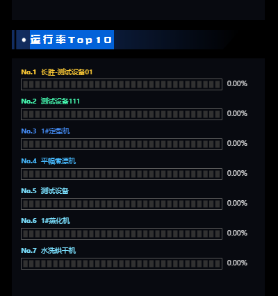

##### ①接口地址：

```shell
/api/mes/board/device/operation/rate/top?workshopId=f8b48230-589a-11ec-afcd-2bd77acada1c
```

##### ② sql执行的过程

```sql
```


##   工厂看板 (二期需求 2023-1-4)

<p style="color:red">所有的维度都是当日的</p>

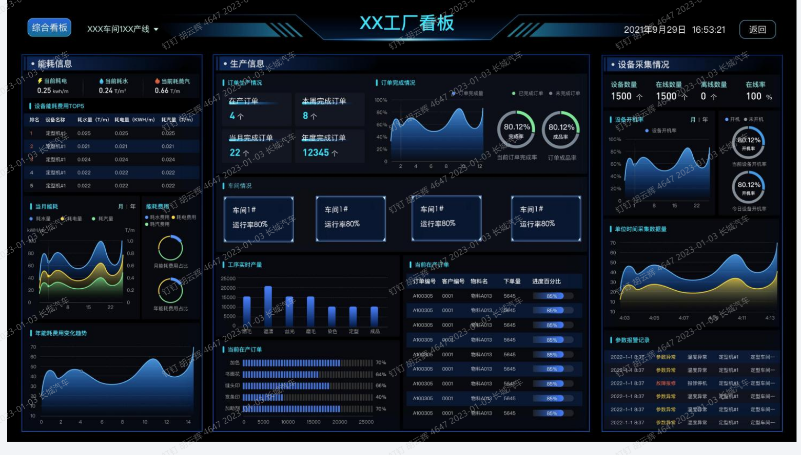


#### :one:能耗信息 :ok_hand:

#####    能耗信息 :ok_hand:

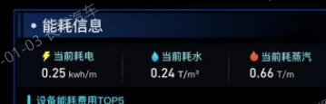

> 1请求地址：
>
> ```shell
>  ?factoryId=24d0aa00-589c-11ec-afcd-2bd77acada1c&productionLineId&workshopId&startTime&endTime
> ```
>
> 

###### sql说明


#####   设备能耗top5 :ok_hand: :bookmark:

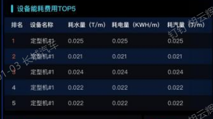

> 设备的水， 电，气的各自的top5

######  接口的说明

```shell
/api/factoryEnergy/queryCurrentTop?factoryId=24d0aa00-589c-11ec-afcd-2bd77acada1c&productionLineId&workshopId&startTime&endTime
```

###### 接口的sql：

```sql
SELECT
    d1.ID AS entity_id,
    MAX ( d1."rename" ) AS deviceName,
    SUM ( to_number( tb.water_added_value, '99999999999999999999999999.9999' ) ) AS water_added_value,
    SUM ( to_number( tb.electric_added_value, '99999999999999999999999999.9999' ) ) AS electric_added_value,
    SUM ( to_number( tb.gas_added_value, '99999999999999999999999999.9999' ) ) AS gas_added_value,
    SUM ( to_number( tb.capacity_added_value, '99999999999999999999999999.9999' ) ) AS capacity_added_value,
    MAX ( tb.ts ) AS ts 
FROM
    device d1
    LEFT JOIN hs_statistical_data tb ON d1.ID = tb.entity_id 
    AND tb.ts >=?   -- 今天的开始时间
    AND tb.ts <?  -- 今天的结束时间
WHERE
    1 = 1 
    AND d1.factory_id = ?  -- 当前工厂id
GROUP BY
    d1.ID
```


##### 当月能耗  :ok_hand:

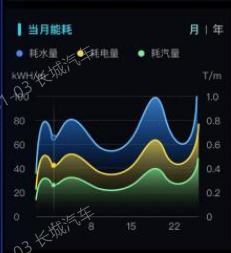

> 1 请求地址：
>
> ```shell
> /api/factoryEnergy/queryTrendChart?productionLineId&workshopId&startTime&endTime&dimension=MONTHS
> ```
>
> 

######  能耗费用 :no_entry:

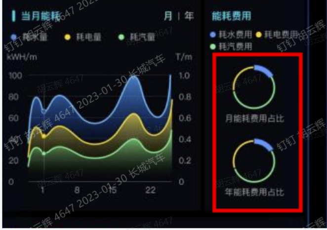

> 再原接口中增加 ，水 ，电 气的能耗费用


###### 

```shell
select *  from dbo.hwEnergy ; --nCurrPrice 单价

```


##### 年度耗费变化趋势 :ok_hand:

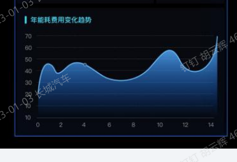


##### 能耗费用的仪表盘接口

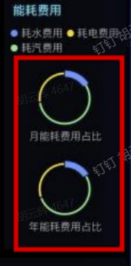

###### 接口

```shell
```


#### :two: 生产信息（看板的中间部分）

#####     ①车间情况  :ok_hand:

######   1 需求截图如下

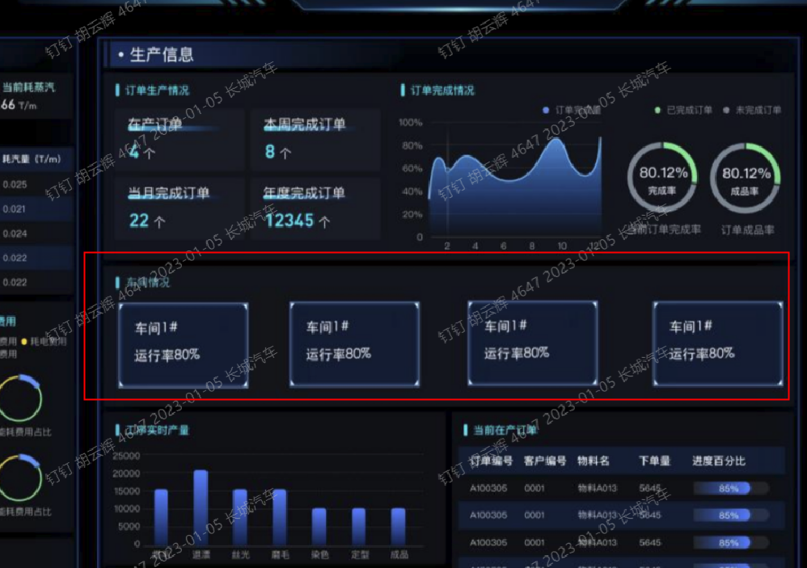

 <span style="color:#ff0066"> 备注:</span>

<p style="color:#3399ff">  1 .查询的是该工厂下车间列表，</p>

   <p style="color:#cc6600;">WorkshopService.<span style="color:#ffff00">findWorkshopListByTenant</span>(UUID tenantId,UUID factoryId)</p>

<p style="color:#77ff33"> 2 运行率: <span style="color:#ff0000;"> 在线数 ÷ 车间设备数 </span>    </p>

<p style="color:#e67300">  FactoryCollectionInformationSvc.<span style="color:#ffff00">queryDeviceStatusNum</span>(TenantId tenantId,   FactoryDeviceQuery factoryDeviceQuery)<p>
###### 2 接口地址：

```shell
/api/factoryProduction/queryWorkshopAndRunRate?factoryId=24d0aa00-589c-11ec-afcd-2bd77acada1c
```

##### ②订单生产情况  `已经提供sql` :libra:  :ok_hand:

######  2-1 需求截图：

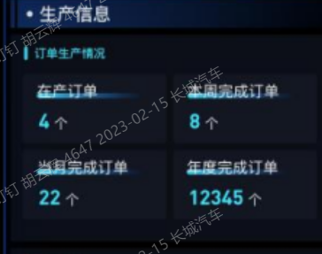

###### 2-2 需求提供的sqlServer  sql语句：

```sql
SELECT 在产订单=COUNT(1)
FROM (
SELECT DISTINCT A.sOrderNo
FROM dbo.sdOrderHdr A(NOLOCK)
JOIN dbo.sdOrderDtl B(NOLOCK) ON B.usdOrderHdrGUID=A.uGUID
JOIN dbo.sdOrderLot C(NOLOCK) ON C.usdOrderDtlGUID = B.uGUID AND C.sLotStatus='生产' 
) A1

SELECT 本周完成订单=COUNT(1)
FROM (
SELECT A.sOrderNo,tTime=MAX(C.tUpdateTime)
FROM dbo.sdOrderHdr A(NOLOCK)
JOIN dbo.sdOrderDtl B(NOLOCK) ON B.usdOrderHdrGUID=A.uGUID
JOIN dbo.sdOrderLot C(NOLOCK) ON C.usdOrderDtlGUID = B.uGUID AND C.sLotStatus='完成' 
LEFT JOIN dbo.sdOrderLot D(NOLOCK) ON D.usdOrderDtlGUID = B.uGUID AND D.sLotStatus='生产' 
WHERE D.uGUID IS NULL
GROUP BY A.sOrderNo
HAVING MAX(C.tUpdateTime)>=DATEADD(WEEK,DATEDIFF(WEEK,0,GETDATE()),0) 
) A1

SELECT 当月完成订单=COUNT(1)
FROM (
SELECT A.sOrderNo,tTime=MAX(C.tUpdateTime)
FROM dbo.sdOrderHdr A(NOLOCK)
JOIN dbo.sdOrderDtl B(NOLOCK) ON B.usdOrderHdrGUID=A.uGUID
JOIN dbo.sdOrderLot C(NOLOCK) ON C.usdOrderDtlGUID = B.uGUID AND C.sLotStatus='完成' 
LEFT JOIN dbo.sdOrderLot D(NOLOCK) ON D.usdOrderDtlGUID = B.uGUID AND D.sLotStatus='生产' 
WHERE D.uGUID IS NULL
GROUP BY A.sOrderNo
HAVING MAX(C.tUpdateTime)>=DATEADD(MONTH,DATEDIFF(MONTH,0,GETDATE()),0)
) A1


SELECT 年度完成订单=COUNT(1)
FROM (
SELECT A.sOrderNo,tTime=MAX(C.tUpdateTime)
FROM dbo.sdOrderHdr A(NOLOCK)
JOIN dbo.sdOrderDtl B(NOLOCK) ON B.usdOrderHdrGUID=A.uGUID
JOIN dbo.sdOrderLot C(NOLOCK) ON C.usdOrderDtlGUID = B.uGUID AND C.sLotStatus='完成' 
LEFT JOIN dbo.sdOrderLot D(NOLOCK) ON D.usdOrderDtlGUID = B.uGUID AND D.sLotStatus='生产' 
WHERE D.uGUID IS NULL
GROUP BY A.sOrderNo
HAVING MAX(C.tUpdateTime)>=DATEADD(YEAR,DATEDIFF(YEAR,0,GETDATE()),0)
) A1
```


###### 2-3 接口地址

```shell
#GET请求
/api/factoryProduction/getOrderProduction
## 直接配置SqlOnFieldAnnotation 注解，
 调用 SqlServerBascFactoryImpl.executeSqlByObject
 ##内部通过反射赋值的；
```

###### 2-4出参说明

```json
{
"inProductionOrder": "748", //在产订单
"orderCompleterThisWeek": "0", //本周完成订单
"orderCompletedThisMonth": "0", //当月完成订单
"annualCompletedOrder": "0" //年度完成订单
}
```


##### ③  订单的 完成率  和 成品率  `已经提供了sql` :libra: :ok_hand:

###### 3-1  需求的截图


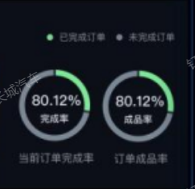

###### 3-2 提供的sql:

```sql
SELECT 成品率=CAST(SUM(ISNULL(D.nInQty,0))*100.0/SUM(C.nQty) AS NUMERIC(18,2))
FROM dbo.sdOrderHdr A(NOLOCK)
JOIN dbo.sdOrderDtl B(NOLOCK) ON B.usdOrderHdrGUID=A.uGUID
JOIN dbo.sdOrderLot C(NOLOCK) ON C.usdOrderDtlGUID = B.uGUID
LEFT JOIN (
SELECT B1.usdOrderLotGUID,nInQty=SUM(B1.nInQty)
FROM dbo.mmSTInHdr A1(NOLOCK) 
JOIN dbo.mmSTInDtl B1(NOLOCK) ON B1.ummInHdrGUID = A1.uGUID
GROUP BY B1.usdOrderLotGUID
) D ON D.usdOrderLotGUID = C.uGUID


SELECT 订单完成率=CAST((B.iCount-A.iCount)*100.0/B.iCount AS NUMERIC(18,2))
FROM (
SELECT iCount=COUNT(1)
FROM (
SELECT DISTINCT A2.sOrderNo
FROM dbo.sdOrderHdr A2(NOLOCK)
JOIN dbo.sdOrderDtl B2(NOLOCK) ON B2.usdOrderHdrGUID=A2.uGUID
JOIN dbo.sdOrderLot C2(NOLOCK) ON C2.usdOrderDtlGUID = B2.uGUID AND C2.sLotStatus='生产' 
) A1
) A
JOIN (
SELECT iCount=COUNT(1) FROM dbo.sdOrderHdr A3(NOLOCK)
) B ON 1=1
```


###### 3-3 开发的接口：

```shell
#GET请求
/api/factoryProduction/getOrderCompletionRateAndYieldRate
```

###### 3-4 返回参数说明:

```json
{
"orderCompletionRate": "0.00%", //成品率
"yieldRate": "0.40%" //订单完成率
}
```


##### ④ 订单完成情况  :libra: :ok_hand:

###### 4-1 需求截图

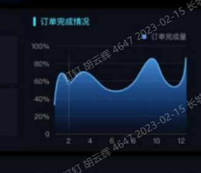

###### 4-2 提供的sql：

```sql
SELECT 日期=A1.tTime,订单完成数量=COUNT(1)
FROM (
SELECT A.sOrderNo,tTime=MAX(CONVERT(NVARCHAR(10),C.tUpdateTime,120))
FROM dbo.sdOrderHdr A(NOLOCK)
JOIN dbo.sdOrderDtl B(NOLOCK) ON B.usdOrderHdrGUID=A.uGUID
JOIN dbo.sdOrderLot C(NOLOCK) ON C.usdOrderDtlGUID = B.uGUID AND C.sLotStatus='完成' 
LEFT JOIN dbo.sdOrderLot D(NOLOCK) ON D.usdOrderDtlGUID = B.uGUID AND D.sLotStatus='生产' 
WHERE D.uGUID IS NULL
GROUP BY A.sOrderNo
HAVING MAX(C.tUpdateTime)>=DATEADD(DAY,-7,CONVERT(NVARCHAR(10),GETDATE(),120)) 
) A1
GROUP BY A1.tTime
```


###### 4-3 提供的接口

```shell
/api/factoryProduction/queryListOrderFulfillmentVo
```


#####  ⑤  工序实时产量  :libra:  :ok_hand:

######  5-1 需求截图

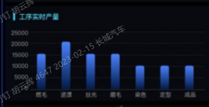

###### 5-2 提供的sql:

```sql
SELECT 工序=C.sWorkingProcedureName,产量=SUM(A.nTrackQty)
FROM dbo.ppTrackOutput A(NOLOCK)
JOIN dbo.ppTrackJob B(NOLOCK) ON B.uGUID = A.uppTrackJobGUID
JOIN dbo.pbWorkingProcedure C(NOLOCK) ON C.uGUID=B.upbWorkingProcedureGUID
WHERE A.tTrackTime>=CONVERT(NVARCHAR(10),GETDATE(),120)
GROUP BY C.sWorkingProcedureName
```

######  5-3 提供的接口

```shell
/api/factoryProduction/queryListProcessRealTimeOutputVo
```


##### ⑥当前在产订单  :libra:   :ok_hand:

###### 6-1 需求截图

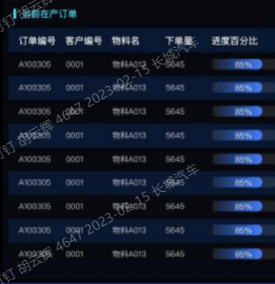

###### 6-2 提供的sql

```sql
SELECT 订单编号=A.sOrderNo,客户编号=F.sCustomerNo,物料名=dbo.fnpbConcatStringEx(G.sMaterialName,','),下单数=SUM(D.nQty),进度百分比=SUM(ISNULL(E.iCount,0))*100/SUM(D.iCount)
FROM dbo.sdOrderHdr A(NOLOCK)
JOIN dbo.sdOrderDtl B(NOLOCK) ON B.usdOrderHdrGUID=A.uGUID
JOIN dbo.sdOrderLot C(NOLOCK) ON C.usdOrderDtlGUID = B.uGUID AND C.sLotStatus='生产' 
JOIN dbo.pbCustomer F(NOLOCK) ON F.uGUID = A.upbCustomerGUID
JOIN dbo.mmMaterial G(NOLOCK) ON G.uGUID=B.ummMaterialGUID
JOIN (
SELECT A1.usdOrderDtlGUID,iCount=COUNT(1),nQty=SUM(A1.nQty)
FROM dbo.sdOrderLot A1(NOLOCK)
GROUP BY A1.usdOrderDtlGUID
) D ON D.usdOrderDtlGUID = B.uGUID
LEFT JOIN (
SELECT A2.usdOrderDtlGUID,iCount=COUNT(1)
FROM dbo.sdOrderLot A2(NOLOCK)
WHERE A2.sLotStatus='完成'
GROUP BY A2.usdOrderDtlGUID
) E ON E.usdOrderDtlGUID = B.uGUID
GROUP BY A.sOrderNo,F.sCustomerNo
```

######  6-3 提供的接口

```shell
/api/factoryProduction/queryCurrentOrdersInProduction
##注意排序 --产品提的排序是订单时间： 且top10s
SELECT MIN(A.tCreateTime),订单编号=A.sOrderNo,客户编号=F.sCustomerNo,物料名=dbo.fnpbConcatStringEx(G.sMaterialName,','),下单数=SUM(D.nQty),进度百分比=SUM(ISNULL(E.iCount,0))*100/SUM(D.iCount)
FROM dbo.sdOrderHdr A(NOLOCK)
JOIN dbo.sdOrderDtl B(NOLOCK) ON B.usdOrderHdrGUID=A.uGUID
JOIN dbo.sdOrderLot C(NOLOCK) ON C.usdOrderDtlGUID = B.uGUID AND C.sLotStatus='生产' 
JOIN dbo.pbCustomer F(NOLOCK) ON F.uGUID = A.upbCustomerGUID
JOIN dbo.mmMaterial G(NOLOCK) ON G.uGUID=B.ummMaterialGUID
JOIN (
SELECT A1.usdOrderDtlGUID,iCount=COUNT(1),nQty=SUM(A1.nQty)
FROM dbo.sdOrderLot A1(NOLOCK)
GROUP BY A1.usdOrderDtlGUID
) D ON D.usdOrderDtlGUID = B.uGUID
LEFT JOIN (
SELECT A2.usdOrderDtlGUID,iCount=COUNT(1)
FROM dbo.sdOrderLot A2(NOLOCK)
WHERE A2.sLotStatus='完成'
GROUP BY A2.usdOrderDtlGUID
) E ON E.usdOrderDtlGUID = B.uGUID
GROUP BY A.sOrderNo,F.sCustomerNo
```


#####  ⑦工序实时进度 :libra:   :bookmark:

###### 需求截图：

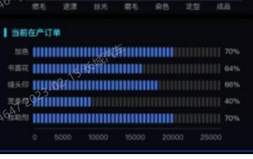


> 

###### 提供的sql--待

```sql
SELECT 工序=C.sWorkingProcedureName,在产数量=COUNT(1)
FROM dbo.mnProducting A(NOLOCK)
JOIN dbo.emEquipment B(NOLOCK) ON B.uGUID=A.uemEquipmentGUID AND B.upbWorkCentreGUID='30448BD5-C24C-7B19-F67B-15A3CBF1FCA4'
JOIN dbo.pbWorkingProcedure C(NOLOCK) ON C.uGUID=A.upbWorkingProcedureGUID
GROUP BY C.sWorkingProcedureName
```

###### 提供的接口

```shell
GET /api/factoryProduction/queryCurrentOrdersInProduction07
```

###### 接口出参缩略说明:

```json
[
	{
		"processName": "水洗烘干", //工序
		"percentage": "20"  // 在产数量/总数
	},
	...
]
```


#### :three: 设备采集情况 :ok_hand:


##### ① 设备 总数-在线数-离线数 -在线率 :ok_hand:

######    1 需求截图如下

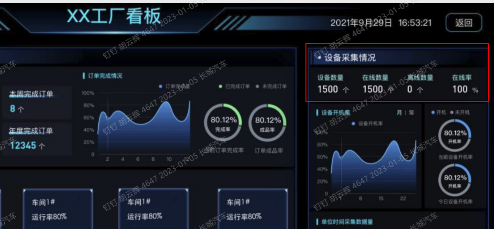

 <span style="color:#ff0066"> 备注:</span>

<p style="color:#3399ff"> 在线率： 在线设备 ÷ 设备数量（总数）</p>

<p style="color:#88ff4d"> 设备数量，在线数量，离线数量 ，可以调用现有的接口：<span style="color:#e67300"> DeviceMonitorService.getDeviceOnlineStatusData(TenantId tenantId, FactoryDeviceQuery query)</span></p>

###### 2 接口地址：

```shell
/api/factoryCollectionInformation/queryDeviceStatusNum?factoryId=24d0aa00-589c-11ec-afcd-2bd77acada1c
```

###### 3 接口返回json:

```json
{
	"onLineDeviceCount": 2,
	"offLineDeviceCount": 19,
	"allDeviceCount": 21,
	"onlineRate": "9.52%"
}
```


##### ②单位时间采集数量 :ok_hand:

######  需求截图


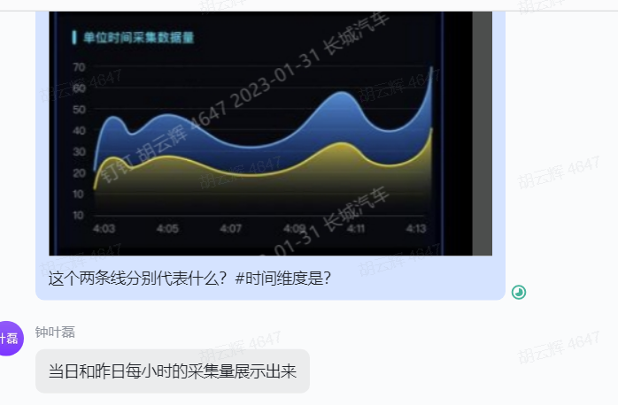


###### 接口地址

```shell
/api/factoryCollectionInformation/queryCollectionVolumeByHourly?factoryId=24d0aa00-589c-11ec-afcd-2bd77acada1c
```


##### ③设备运行率趋势图  :ok_hand:

###### 需求截图

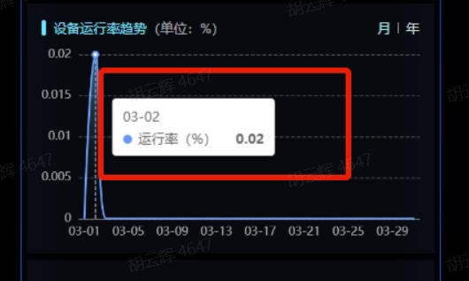


###### sql

```sql
SELECT  tenant_id, entity_id, bdate, (total_time + start_time) time01
FROM public.trep_day_sta_detail
where  bdate='2023-01-06';-- 设备 和天
--  月 (开始-结束） 
   开机时长 / 可用时间 月 (开始-结束）  /设备数
```

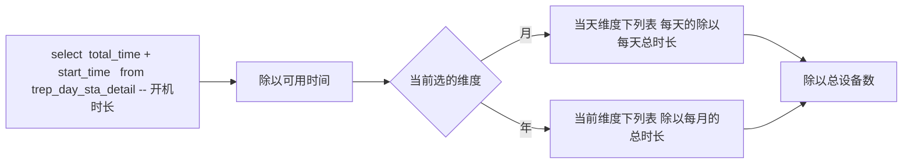

###### 月的sql验证

```sql
select ''''|| id ||''','  from device  d1  where d1.factory_id='e7fd0750-589a-11ec-afcd-2bd77acada1c' and
cast(d1.additional_info as JSON)->>'gateway'='false';

--本月的维度
SELECT  t1.bdate, sum((t1.total_time + t1.start_time)) bootTime
FROM public.trep_day_sta_detail t1
where  t1.bdate>= date_trunc( 'month', now() )
and entity_id in (
'0049e500-6465-11ec-903a-0b302b886cc7',
'0035e7d0-6465-11ec-903a-0b302b886cc7',
'0048d391-6465-11ec-903a-0b302b886cc7',
'2aef6370-66b8-11ec-8dcb-b51fb7f5595c',
'54c36c40-8b3e-11ed-ba08-4f54a6e474ed',
'd43fad50-f839-11ec-959a-49b2515e30de',
'2b6e2db0-b8d1-11ed-9103-d7ce56abd43f',
'3145d610-b986-11ed-9071-0912c0164f23'
) group by bdate
-- 72971920

select round(72971920::numeric/86400000::numeric/8::numeric,4)

-- 年的
```


###### 接口：

```shell
/api/factoryCollectionInformation/queryTrendChartOfOperatingRate?factoryId=dd794c00-c783-11ec-83d2-a1d596c09d68&dimension=MONTHS
```


##### ④开机率的饼状图接口

###### 需求截图


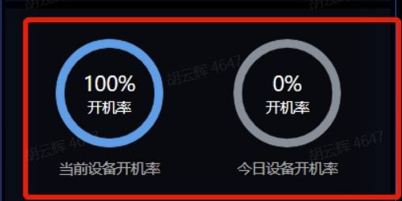


###### 接口

```shell
 /api/factoryCollectionInformation/queryPieChart?factoryId=dd794c00-c783-11ec-83d2-a1d596c09d68
```

###### 接口描述

```shell
 1.查询当前工厂下所有的设备id; # select  *  from  device where factory_id =?..
 2.查询设备的开机率的统计表: 
 SELECT   t1.bdate, sum((t1.total_time + t1.start_time)) bootTime FROM trep_day_sta_detail t1 where t1.bdate= :bdate and  entity_id in  (:deviceIdList) group by bdate
 3. 将[2]中查询出的
   bootTime {总开机率时长，毫秒时间单位} ÷86400000L{1天的毫秒总时间} ➗ 设备总数 {[sql2]}
 
```


# PC端

## 效能分析


### 产量分析

#### 1 产量分析列表接口

```shell
##天维度查
/api/pc/efficiency/queryCapacity?pageSize=10&page=0&startTime=1669564800000&endTime=1669651199999&factoryId=24d0aa00-589c-11ec-afcd-2bd77acada1c&workshopId=&productionLineId=&deviceId=

##精确毫秒查询  (新增接口)
/api/pc/efficiency/queryCapacityOnSecondLeve?pageSize=10&page=0&startTime=1669564800000&endTime=1669651199999&factoryId=24d0aa00-589c-11ec-afcd-2bd77acada1c&workshopId=&productionLineId=&deviceId=
```

```java
        List<EnergyEffciencyNewEntity> entityList1 = performanceAnalysisListSvc.yieldList(vo);

```


### 能耗

#### 1 能耗列表接口

```shell
/api/pc/efficiency/queryEntityByKeysNew?pageSize=10&page=0&startTime=1669564800000&endTime=1669651199999&factoryId=24d0aa00-589c-11ec-afcd-2bd77acada1c&workshopId=&productionLineId=&deviceId=

##精确毫秒查询接口
/api/pc/efficiency/queryEntityByKeysNewOnSecondLeve?pageSize=10&page=0&startTime=1669564800000&endTime=1669651199999&factoryId=24d0aa00-589c-11ec-afcd-2bd77acada1c&workshopId=&productionLineId=&deviceId=
	

```


```java

        List<EnergyEffciencyNewEntity> entityList1 = performanceAnalysisListSvc.queryEnergyListAll(queryTsKvVo);
        List<EnergyEffciencyNewEntity> entityList = orderByAllValue(entityList1);
        Page<EnergyEffciencyNewEntity> page = PageUtil.createPageFromList(entityList, pageLink);
        List<EnergyEffciencyNewEntity> pageList = page.getContent();
        List<EfficiencyEntityInfo> efficiencyEntityInfoList = this.resultProcessingByEnergyPcNew(pageList);
        //将查询的结果返回原接口返回的对象
        EfficiencyTotalValue efficiencyTotalValue= getTotalValueNewMethodnew(entityList1);
        return new PageDataAndTotalValue<EfficiencyEntityInfo>(efficiencyTotalValue, efficiencyEntityInfoList, page.getTotalPages(), page.getTotalElements(), page.hasNext());
```


# 需求

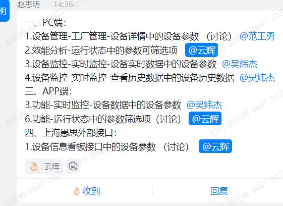


```shell
/api/three/kanban/integratedDeviceInterface


```


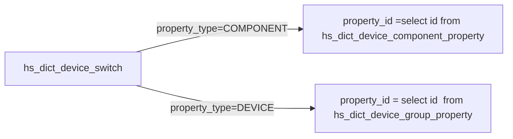


# 长胜二期需求

```shell
122.224.36.54 14330  saas-dev   HS@2021@saaA
db:  HSDyeingerp
```


## 产量班组

> 1


## 3.效能分析订单接口

### 3-1 需求截图

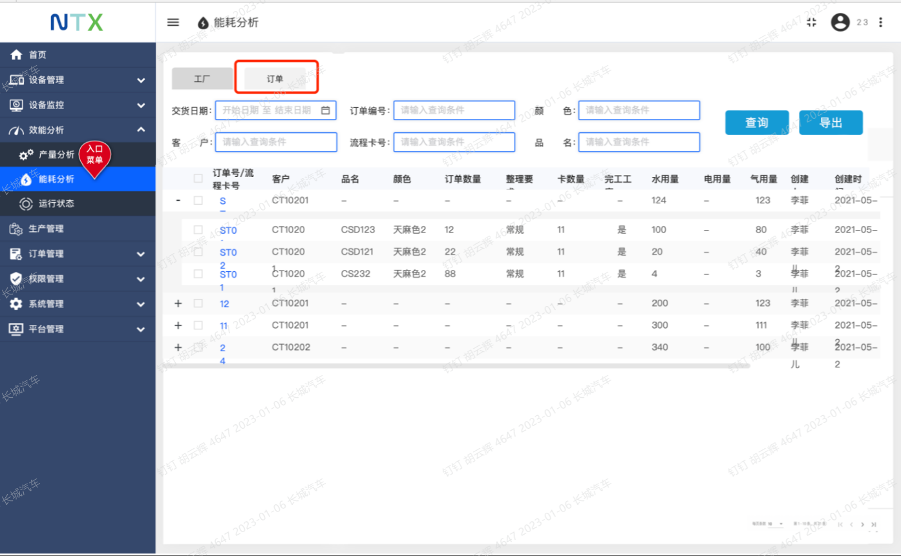

```sql
SELECT 订单号=A.sOrderNo,客户=C.sCustomerName,品名=D.sMaterialName,颜色=E.sColorName,订单数量=B.nQty,
卡数量=F.iCount,创建者=A.sCreator,创建时间=A.tCreateTime,G.sName,G.nUseValue
FROM dbo.sdOrderHdr A (NOLOCK)
JOIN dbo.sdOrderDtl B (NOLOCK)ON B.usdOrderHdrGUID=A.uGUID
JOIN dbo.pbCustomer C (NOLOCK) ON C.uGUID=A.upbCustomerGUID
JOIN dbo.mmMaterial D (NOLOCK) ON D.uGUID=B.ummMaterialGUID
JOIN dbo.tmColor E (NOLOCK) ON E.uGUID=B.utmColorGUID
LEFT JOIN(
SELECT B1.usdOrderDtlGUID,iCount=COUNT(1)
FROM dbo.psWorkFlowCard A1 (NOLOCK)
JOIN dbo.sdOrderLot B1 (NOLOCK) ON B1.uGUID=A1.usdOrderLotGUID
GROUP BY B1.usdOrderDtlGUID
)F ON F.usdOrderDtlGUID=B.uGUID
LEFT JOIN(
SELECT C2.usdOrderDtlGUID,F2.sName,nUseValue=SUM(ISNULL(E2.nUseValue,0))
FROM dbo.mnProducted A2 (NOLOCK)
JOIN dbo.psWorkFlowCard B2 (NOLOCK) ON B2.sCardNo=A2.sCardNo
JOIN dbo.sdOrderLot C2 (NOLOCK) ON C2.uGUID=B2.usdOrderLotGUID
JOIN dbo.mnProductedExpend E2 (NOLOCK) ON E2.umnProductedGUID=A2.uGUID
JOIN dbo.hwEnergy F2 (NOLOCK) ON F2.sCode=E2.sEngCode
GROUP BY C2.usdOrderDtlGUID,F2.sName
)G ON G.usdOrderDtlGUID=B.uGUID


```


### 3-2项目中的sql

```sql
SELECT 订单号=A.sOrderNo,客户=C.sCustomerName,品名=D.sMaterialName,颜色=E.sColorName,订单数量=B.nQty,
卡数量=F.iCount,创建者=A.sCreator,创建时间=A.tCreateTime
FROM dbo.sdOrderHdr A (NOLOCK)
JOIN dbo.sdOrderDtl B (NOLOCK)ON B.usdOrderHdrGUID=A.uGUID
JOIN dbo.pbCustomer C (NOLOCK) ON C.uGUID=A.upbCustomerGUID
JOIN dbo.mmMaterial D (NOLOCK) ON D.uGUID=B.ummMaterialGUID
JOIN dbo.tmColor E (NOLOCK) ON E.uGUID=B.utmColorGUID
LEFT JOIN(
SELECT B1.usdOrderDtlGUID,iCount=COUNT(1)
FROM dbo.psWorkFlowCard A1 (NOLOCK)
JOIN dbo.sdOrderLot B1 (NOLOCK) ON B1.uGUID=A1.usdOrderLotGUID
GROUP BY B1.usdOrderDtlGUID
)F ON F.usdOrderDtlGUID=B.uGUID

```

